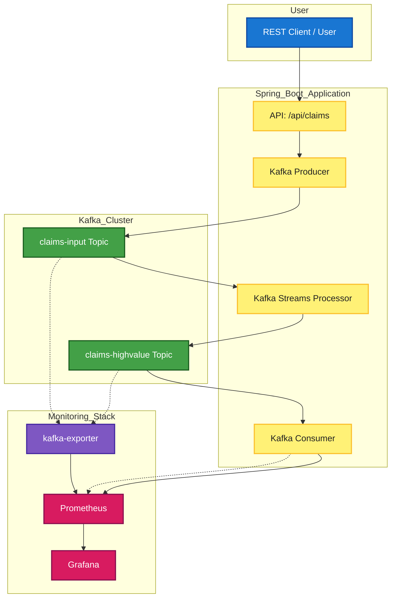

# Kafka Claims Processing Architecture



---

# What does the Spring Boot app do?

This Spring Boot application implements a full Kafka-based claims processing pipeline:

- **Producer**: Accepts HTTP POST requests at `/api/claims` and publishes claim data to the Kafka topic `claims-input`.
- **Kafka Streams Processor**: Reads from `claims-input`, filters high-value claims (amount > 1000), and writes them to the `claims-highvalue` topic. It also aggregates claim amounts per patient in 1-minute windows (logging the totals).
- **Consumer**: Listens to `claims-highvalue`, increments a Prometheus metric (`claims_highvalue_processed`), and logs each high-value claim.

**In summary:**
Receives claims via REST → streams and filters them in Kafka → exposes metrics and logs for monitoring.

## Viewing Processed Claim Data

Prometheus metrics only show counts, not the actual claim data. To see the real claim payloads processed by the stream:

**1. View messages in Kafka topics:**

To see high-value claims processed by the stream, run:

```bash
docker compose exec kafka kafka-console-consumer --bootstrap-server localhost:9092 --topic claims-highvalue --from-beginning
```

**2. Check application logs:**

The Spring Boot app logs each high-value claim processed. Check the logs in your terminal or log file for lines like:

```shell
High-value claim alert: id=..., patient=..., amount=...
```

### API Documentation (Swagger UI)

After starting the Spring Boot app, you can access the Swagger UI for API documentation at:

- [http://localhost:8080/swagger-ui.html](http://localhost:8080/swagger-ui.html)
- or [http://localhost:8080/swagger-ui/index.html](http://localhost:8080/swagger-ui/index.html)

This page provides interactive API documentation and allows you to test endpoints directly from the browser.

## Kafka PoC - Claims Processing Pipeline

This repository provides a quick PoC for a Kafka-based claims processing pipeline with a Spring Boot producer, Kafka Streams processing, a consumer exposing Prometheus metrics, Docker Compose for Kafka, and an Ansible playbook to automate setup.

Components

- `docker-compose.yml` - Single-node Kafka + Zookeeper (Confluent images).
- `spring-kafka-claims/` - Spring Boot application (producer + streams + consumer).
- `ansible/playbook.yml` - Local automation to build the app, start Kafka, create topics, and run the Spring Boot app.
- `.github/workflows/ci.yml` - CI job that builds and tests the Spring app.

Quick start (local)
## Python Virtual Environment for Ansible

It is recommended to use a Python virtual environment for running Ansible and related tools. This keeps dependencies isolated and avoids conflicts with system packages.

### Setup Python venv and install requirements

```bash
python3 -m venv .venv
source .venv/bin/activate
pip install -r requirements.txt
ansible-galaxy collection install -r ansible/requirements.yml
```

You can now run all Ansible commands from within the virtual environment.


Requirements:

- Docker & Docker Compose (for running everything with Ansible or Compose)
- Ansible (recommended for automation)
- Java 21 & Maven (only if you want to build/run the Spring Boot app manually)

## Quick Start (Recommended: Ansible)


All operations (build, run, stop, topic creation) are automated with Ansible and tags:

### Start all services (build, run, create topics)

```bash
ansible-playbook ansible/playbook.yml --tags start
```
- Start Kafka, Zookeeper, and the app
- Create required topics if needed

### Show last 100 lines of logs for all services

```bash
ansible-playbook ansible/playbook.yml --tags logs
```

This will print the last 100 lines of logs from all containers.

### Stop all services

```bash
ansible-playbook ansible/playbook.yml --tags stop
```

If you need to run Docker Compose manually:

```bash
docker compose up --build -d
```

```shell

Usage

- POST claims to `http://localhost:8080/api/claims` with JSON body:

```json
{
  "id": "c1",
  "patientId": "p1",
  "amount": 1500.0,
  "status": "NEW",
  "createdAt": "2025-12-12T10:00:00Z"
}
```

High-value claims (amount > 1000) are sent to topic `claims-highvalue` and processed by a consumer which increments a Prometheus metric `claims_highvalue_processed` accessible via `/actuator/prometheus`.

## Viewing Topic Messages via REST

You can view the latest 100 messages from the `claims-input` topic using the built-in REST endpoint:

```shell
GET http://localhost:8080/api/topic-log
```

This returns a JSON array of Claim objects currently in the topic log buffer.

## Troubleshooting

- If you see deserialization errors, make sure you are using Java 21 and have trusted packages set to `*` in both application.yml and KafkaConsumerConfig.
- If you get CORS errors from a frontend, CORS is enabled for all origins by default in this app.
- To reset consumer group offsets (e.g., after a deserialization error):

  ```bash
  docker compose exec kafka kafka-consumer-groups --bootstrap-server kafka:9092 --group claims-app --topic claims-input --reset-offsets --to-latest --execute
  ```

## What's next

- Extend Ansible to deploy to remote hosts and containerize the Spring app.
- Extend tests to assert Streams topology outputs.
- Further customize Grafana dashboards or add alerting as needed.
